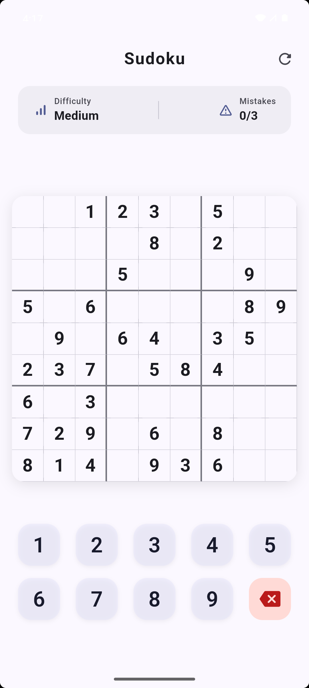
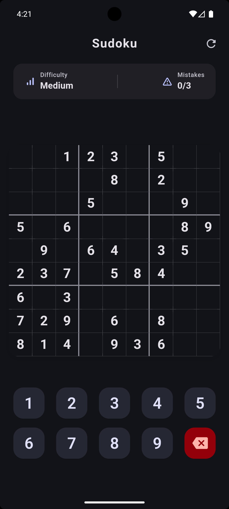

# Sudoku Generator

[](https://pub.dev/packages/sudoku_generator)

A modern, beautiful Sudoku game widget built with Flutter and Riverpod. This package provides a complete, production-ready Sudoku game that you can easily integrate into your Flutter applications.

## ✨ Features

- 🎮 **Complete Game Logic**: Automatic puzzle generation, validation, and solution checking
- 🎨 **Modern UI**: Beautiful Material Design 3 interface with smooth animations
- 🌓 **Theme Support**: Automatically adapts to light and dark themes
- 📱 **Responsive Design**: Works seamlessly on phones, tablets, and desktop
- 🎯 **State Management**: Built with Riverpod for predictable state management
- ⚙️ **Configurable**: Adjustable difficulty levels and mistake limits
- 🏆 **Game Features**: 
  - Cell selection with highlighting
  - Mistake tracking
  - Win/lose detection
  - New game generation
  - Visual feedback for errors
  
|  |  |

## 📦 Installation

Add this to your package's `pubspec.yaml` file:

```yaml
dependencies:
  sudoku_generator: ^1.0.0
  flutter_riverpod: ^3.1.0
```

Then run:

```bash
flutter pub get
```

## 🚀 Quick Start

### Basic Usage

1. **Wrap your app with `ProviderScope`** (required for Riverpod):

```dart
import 'package:flutter/material.dart';
import 'package:flutter_riverpod/flutter_riverpod.dart';
import 'package:sudoku_generator/sudoku_generator.dart';

void main() {
  runApp(const ProviderScope(child: MyApp()));
}

class MyApp extends StatelessWidget {
  const MyApp({super.key});

  @override
  Widget build(BuildContext context) {
    return MaterialApp(
      title: 'Sudoku Game',
      theme: ThemeData(
        colorScheme: ColorScheme.fromSeed(seedColor: Colors.deepPurple),
        useMaterial3: true,
      ),
      home: const GamePage(),
    );
  }
}
```

That's it! The `GamePage` widget provides a complete Sudoku game experience.

### Advanced Usage

For more control over the game state, you can access the `gameProvider`:

```dart
import 'package:flutter_riverpod/flutter_riverpod.dart';
import 'package:sudoku_generator/sudoku_generator.dart';

class CustomGameScreen extends ConsumerWidget {
  const CustomGameScreen({super.key});

  @override
  Widget build(BuildContext context, WidgetRef ref) {
    final gameState = ref.watch(gameProvider);
    
    // Access game state
    print('Mistakes: ${gameState.mistakes}/${gameState.maxMistakes}');
    print('Is Complete: ${gameState.isComplete}');
    
    // Or trigger actions
    ref.read(gameProvider.notifier).startNewGame(40); // Difficulty 40
    
    return const GamePage();
  }
}
```

## 📚 Documentation

### GamePage Widget

The main widget that displays the complete Sudoku game interface.

```dart
const GamePage({Key? key})
```

**Features:**
- App bar with refresh button
- Game statistics display
- Interactive 9x9 Sudoku grid
- Number pad for input
- Automatic win/lose dialogs

### Game State

Access the current game state through the `gameProvider`:

```dart
final gameState = ref.watch(gameProvider);

// Available properties:
gameState.board           // 9x9 grid of SudokuCell
gameState.mistakes        // Current mistake count
gameState.maxMistakes     // Maximum allowed mistakes
gameState.isComplete      // Whether puzzle is solved
gameState.isLoading       // Whether new game is generating
gameState.selectedRow     // Currently selected row (0-8)
gameState.selectedCol     // Currently selected column (0-8)
```

### Game Actions

Control the game through the `GameNotifier`:

```dart
final notifier = ref.read(gameProvider.notifier);

// Start a new game
notifier.startNewGame(50); // difficulty: 50 cells removed

// Select a cell
notifier.selectCell(3, 5); // row 3, col 5

// Input a number
notifier.inputNumber(7); // enters 7 in selected cell
```

## 🎯 Difficulty Levels

The difficulty is controlled by the number of cells removed from the complete puzzle:

- **Easy**: 20-35 cells removed
- **Medium**: 36-50 cells removed (default)
- **Hard**: 51-65 cells removed

```dart
// Start a hard game
ref.read(gameProvider.notifier).startNewGame(60);
```

## 🎨 Theming

The game automatically adapts to your app's theme. It supports:
- Material Design 3
- Light and dark color schemes
- Custom color themes

The game uses your app's `ColorScheme` for consistent styling.

## 📱 Example

Check out the [example](example/) directory for a complete working application.

To run the example:

```bash
cd example
flutter pub get
flutter run
```

## 🤝 Dependencies

- [flutter_riverpod](https://pub.dev/packages/flutter_riverpod) - State management

## 📄 License

MIT License - see the [LICENSE](LICENSE) file for details.

## 🙏 Contributing

Contributions are welcome! Please feel free to submit a Pull Request.

## 📧 Support

If you have any questions or issues, please file them in the [issue tracker](https://github.com/example/sudoku_generator/issues).
